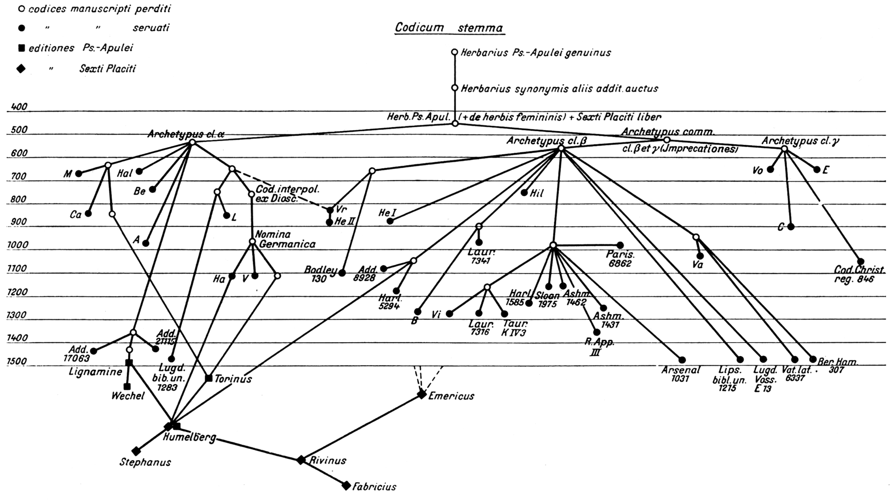
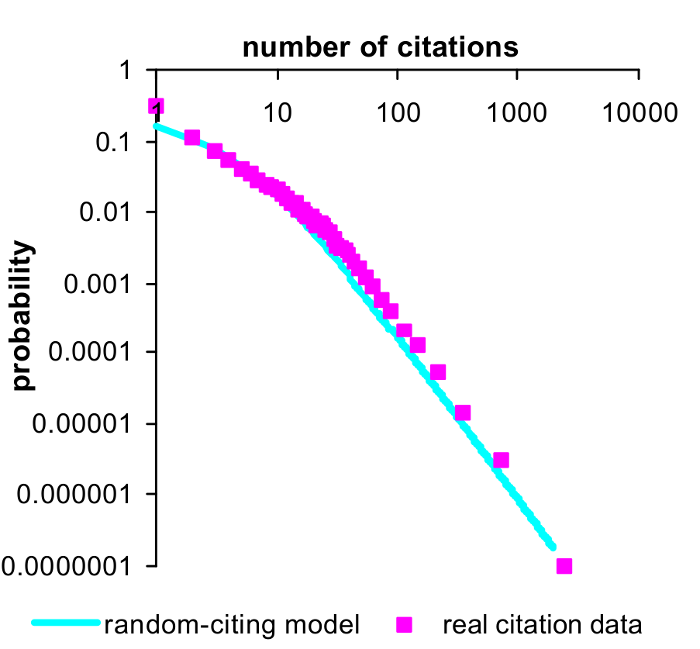

# Read before you cite

$$R = \frac{D}{T}\times\frac{N-T}{N-D},\text{ где}$$

R -- доля людей, прочитавших статью из процитировавших работу;
N -- общее количество цитирований работы
T -- количество работ, процитировавших статью с опечаткой
D -- количество работ, процитировавших статью с уникальной опечаткой

При анализе статьи \cite{Kosterlitz_1973} R = 0.22.

# Не то чтобы ребята первые придумали

Схема распространения манускирптов Псевдо-Апулея Herbarius \cite{musa1927antonii}

# Copied citations create renowned papers

* Кажется, что чем больше цитирований -- тем более выдающаяся работа
* Однако, если большинство цитирований скопировано из чужих списков литературы, значит, если работу уже цитируют, то ее с высокой вероятностью процитируют еще.
* Дальше авторы обсуждают модель случайноцитирующего ученого (random-citing scientists, \cite{simkin2003copied}), который цитирует $m$ случайных статей и копирует часть ссылок из этих статей, каждая с вероятностью $p$. Модель с параметрами $m = 3$ и $p = 1/4$, согласно работе, хорошо описывает данные:

$$N_K \sim \frac{1}{K^{1+(m\times p)^{-1}}} = \frac{1}{K^{2.(3)}}, \text{ где}$$
$N_K$ -- количество работ, которые процитировали K раз

# Copied citations create renowned papers 

# References {.allowframebreaks}

